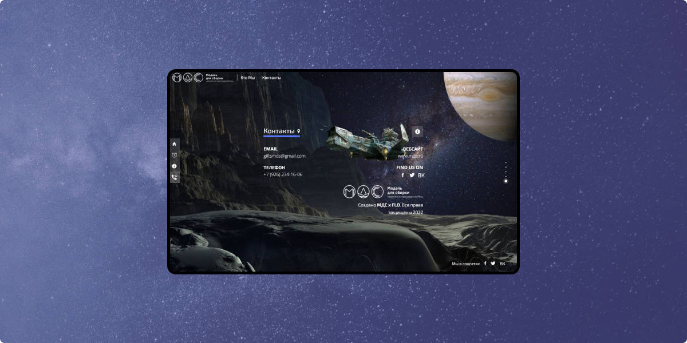

import expanded from './mds-collection/images/1.jpg';
import mc_img3 from './mds-collection/images/3.jpg';
import mc_img4 from './mds-collection/images/4.jpg';
import mc_img5 from './mds-collection/images/5.jpg';
import mc_img6 from './mds-collection/images/6.jpg';

import mc_img7 from './mds-collection/images/7.jpg';
import mc_img8 from './mds-collection/images/8.jpg';
import mc_img9 from './mds-collection/images/9.jpg';

## <Highlight>Goal</Highlight> of the project

"Model to Build" (MDS) is an iconic radio program that has been on the air since 1995. MDS is a literary and musical symbiosis, consisting of the best works of prose, predominantly of a fantastic genre, accompanied by a sound range of the best trends in modern electronic music.

During the years MDS collected more than 1500 stories and wanted to share this collection with everybody.
It should be a mobile application specifically for audio listeners who prefer to easily find a store to listen to right now or create a playlist by mood, genre, or author and share this list with friends or social networks.

Users often want to download a playlist to have it offline while traveling without a network.

## What we’ve done

We decided to create a podcast application with Flutter. For this project, we created everything except content. It means UI/UX, more than 10 screens for the mobile application, a few for the landing page, API, database structure, plugged-in donating service by the subscription model, recommendation system, flexible search, and many other features.

<ExpandedImage
  src={expanded}
/>

<ImagesGrid
  images={[
    mc_img3,
    mc_img4,
    mc_img5,
    mc_img6,
  ]}
/>

<ImagesSlider images={[
  mc_img7,
  mc_img8,
  mc_img9,
]}/>

